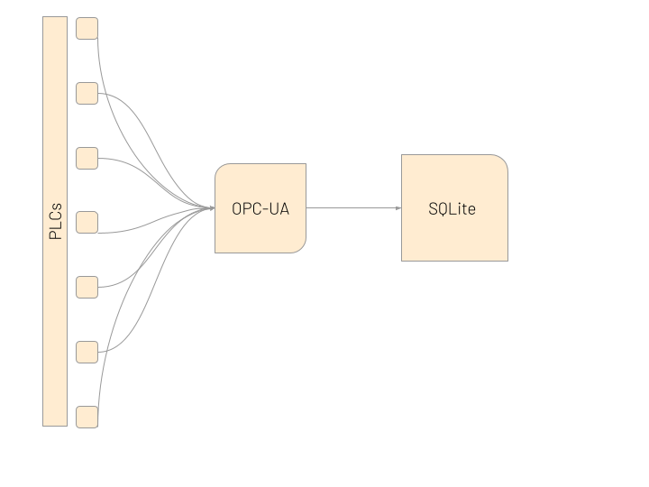

# Manufacturing Analytics Platform


## Overview

This open-source manufacturing analytics platform provides transparency into automated manufacturing processes. The system collects data from industrial PLCs through OPC UA, transforms the data into meaningful metrics, and presents insights through an interactive web dashboard with advanced analytics and AI-powered assistance.

Developed by Heanan Bird (UBC Okanagan - MANF 465)

## Problem Statement

Many small and large-scale manufacturing companies struggle to gain transparency into their automated processes. Manufacturing, quality, and process engineers face:

- Technical resistance to data access
- Administrative overhead for data collection
- Challenges integrating diverse systems
- Lack of affordable, vendor-neutral analytics solutions

Existing commercial solutions like Ignition Automation and Seeq are often expensive and create vendor lock-in, making them impractical for small manufacturers seeking an open-source, flexible solution.

## System Architecture

The platform consists of three primary components:

### 1. Data Engineering
- OPC-UA communication with PLCs 
- Real-time data collection using subscriptions
- SQLite database for efficient storage
- Singleton pattern implementation for robust connections


### 2. Data Science
- Data transformation from raw PLC values to manufacturing metrics
- Calculation of runtime, alarm, and pallet movement statistics
- Time-series analytics with daily and cumulative metrics
- Interactive visualizations using Streamlit and Plotly



### 3. AI/ML Component
- Integration with OpenAI's GPT for natural language insights
- Contextual awareness of manufacturing data
- K-means clustering for station performance analysis
- Predictive analytics capabilities


## Key Features

- **Real-time Data Collection**: Subscribe to PLC data points using OPC-UA
- **Flexible Configuration**: Easy setup of PLCs, data tags, and station names
- **Data Transformation**: Convert binary signals into meaningful metrics
- **Advanced Analytics**: K-means clustering for performance pattern detection
- **Interactive Dashboard**: Streamlit-based web interface with filtering capabilities
- **AI Assistance**: Natural language queries about manufacturing data
- **Open Source**: Built entirely on open-source technologies
- **Vendor Neutral**: No proprietary systems or vendor lock-in

## Installation and Setup

```bash
# Clone the repository
git clone https://github.com/Birdbh/Project.git

# Install dependencies
pip install -r requirements.txt

# Configure your PLCs in config.py
# Update the node_dictionary and station_Names variables

# Start the data collection service
python src/coms/OPCUAclient.py

# Launch the web dashboard
cd src/ui
streamlit run app.py
```

## Repository Structure

```
Project/
├── src/
│   ├── coms/             # Communication module for OPC UA
│   │   ├── OPCUAclient.py  # OPC UA client implementation
│   │   ├── Node.py         # Node representation
│   │   ├── NodeList.py     # Singleton node list manager
│   │   ├── SubHandler.py   # Subscription handler
│   │   ├── SubList.py      # Subscription list manager
│   │   └── config.py       # PLC and node configuration
│   ├── data/             # Data storage and processing
│   │   └── database.py     # SQLite database interface
│   ├── analytics/        # Data analytics module
│   │   └── data_processor.py  # Metrics calculation and transformation
│   └── ui/               # User interface
│       ├── app.py          # Streamlit dashboard application
│       ├── styles/         # CSS styling
│       └── templates/      # HTML templates
```

## Screenshots


## Technology Selection

The project uses carefully selected open-source technologies:

| Component | Technology | Rationale |
|-----------|------------|-----------|
| Communication | OPC UA | Industry standard, real-time capabilities, security features |
| Database | SQLite | Portable, easy setup, SQL compatibility |
| Web Interface | Streamlit | Fast development, built-in features, Python integration |
| Data Processing | Pandas | Powerful data transformation, wide adoption |
| Visualization | Plotly | Interactive charts, 3D visualization support |
| AI Component | OpenAI | Advanced language capabilities, contextual understanding |

## Limitations and Future Work

- Currently optimized for specific PLC tags; could be extended for more generic tag handling
- SQLite may have scalability limitations for very large installations
- Additional machine learning models could enhance predictive capabilities
- UI customization options could be expanded for different user roles

## Contributing

Contributions are welcome! Please feel free to submit a Pull Request.

## License

This project is licensed under the MIT License - see the LICENSE file for details.

## Acknowledgements

- School of Engineering, Faculty of Applied Science, UBC Okanagan
- Contributors to open-source libraries used in this project

## References

1. Zheng, P., Wang, H., Sang, Z. et al. Smart manufacturing systems for Industry 4.0: Conceptual framework, scenarios, and future perspectives. Front. Mech. Eng. 13, 137–150 (2018). 
2. "Seeq | Advanced Analytics, ML & AI for Time Series Data," Seeq, Jan. 29, 2025.
3. "Industrial Automation Software Solutions by Inductive Automation," Inductiveautomation.com, 2016.
4. Li, J. et al. (2005). An Empirical Study on Off-the-Shelf Component Usage in Industrial Projects.
5. Eclipse IoT White Paper - Open Source Software for Industry 4.0
6. Birdbh, "GitHub - Birdbh/Project," GitHub, 2025.
7. "OPC Unified Architecture." Wikipedia, 25 Apr. 2020.
8. "Subscription Class — Python OPC-UA 1.0 Documentation."
9. pandas. "Pandas.DataFrame — Pandas 1.2.4 Documentation." 
10. Sommers, Bill. "Machine Learning in IIoT: Using K-Means Clustering for Predictive Maintenance and OEE."

---
Project completed as part of MANF 465 - Digital Enterprise (2025)